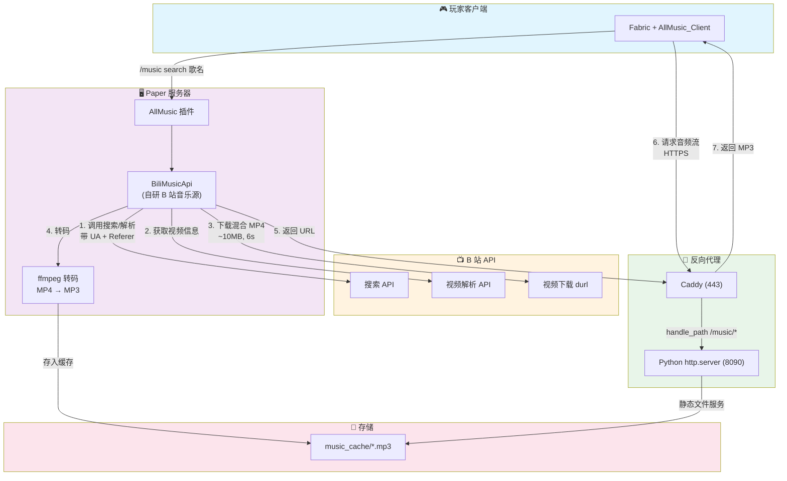
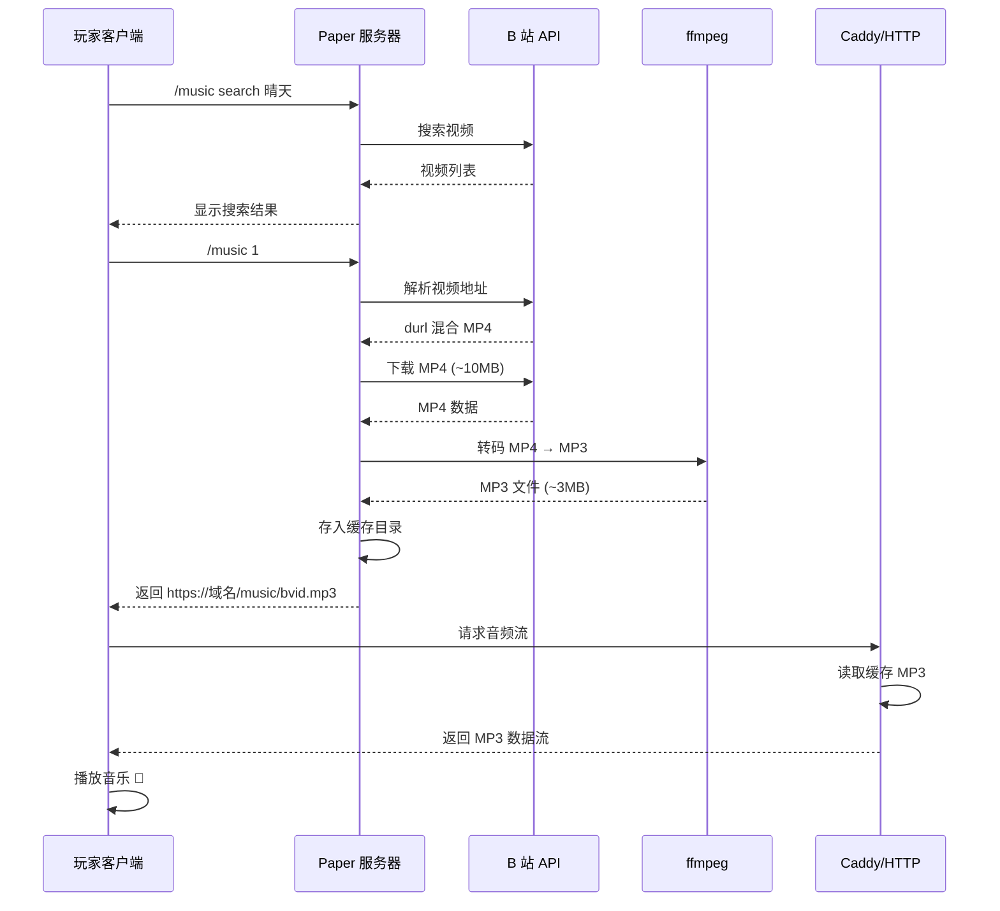
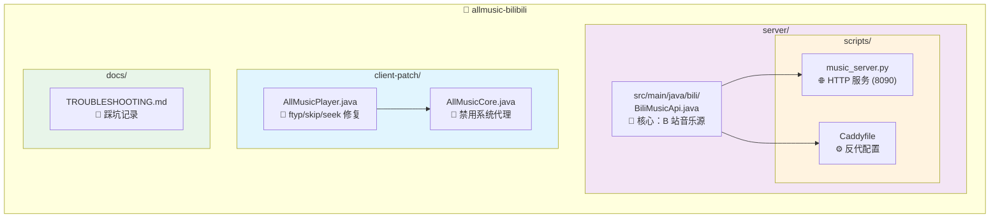

# AllMusic Bilibili 音乐源 + 客户端修复

音乐 HTTP 服务现支持 Range 拖动播放、健康检查、命令行/环境变量配置及本机自动测试。默认仅监听本机，由反向代理提供对外 HTTPS；部署与验证见 [HTTP 服务说明](docs/HTTP_SERVICE.md)。

让 [AllMusic](https://github.com/Coloryr/AllMusic) 插件支持 **Bilibili 视频点歌** 的完整解决方案。

> **背景**：AllMusic 官方只有网易云源（netapi），但网易云 weapi 接口对**云服务器 IP** 有风控（HTTP 200 返回空）。B 站虽然 API 可用，但 **DASH 纯音频接口对数据中心 IP 同样限流**（`fnval=16` 拿不到 audio），只能拿到**含视频轨的混合 MP4**——AllMusic 客户端（按纯音频设计）解不了这种文件。

**本项目解决了什么**：
1. 自研 AllMusic 音乐源 `BiliMusicApi`，实现 B 站视频搜索/解析/点歌
2. 服务端 **ffmpeg 转码**：把 B 站混合 MP4 转成纯 MP3，绕开"客户端解不了混合 MP4"的难题
3. 配套 HTTP 服务 + Caddy 反代，给客户端提供 HTTPS 音频流
4. 客户端修复补丁：解决 B 站 MP4 播放失败、代理截断、seek 重连崩溃等 bug

---

## 架构



<details>
<summary>📊 简化流程图</summary>



</details>

**关键决策**：
- **为什么不用 DASH 纯音频**：B 站对数据中心 IP 的 DASH 接口限流（和网易云 weapi 一样），试了 `fnval=16/80/4048`、带 cookie、各种 UA 都拿不到 `audio`，只稳定返回 durl 混合 MP4
- **为什么服务端转码**：AllMusic 客户端 M4ADecoder 解含视频帧的混合 MP4 会错位（`invalid huffman codebook: 12`），且 `skip()` 跳视频块会断流。服务端转成纯 MP3 是最可靠的解法
- **为什么复用 443**：腾讯云安全组新增端口麻烦，用 Caddy `handle_path /music/*` 反代到本地 8090，客户端走已有 HTTPS

---

## 项目结构



```
allmusic-bilibili/
├── server/
│   ├── src/main/java/bili/BiliMusicApi.java   # 自研 B 站音乐源（核心）
│   └── scripts/
│       ├── music_server.py                    # 音乐静态 HTTP 服务 (8090)
│       └── Caddyfile                          # Caddy 反代配置示例
├── client-patch/
│   ├── AllMusicPlayer.java                    # 客户端修复：ftyp 识别 / skip / seek
│   └── AllMusicCore.java                      # 客户端修复：禁用系统代理
└── docs/
    └── TROUBLESHOOTING.md                     # 踩坑记录（见文末）
```

---

## 部署步骤

### 前置要求
- Paper 26.1.2（AllMusic 4.x）服务器
- Java 17+
- **ffmpeg**（服务端转码用）：`sudo apt install ffmpeg`
- Caddy（或任意反代）：`sudo apt install caddy`

### 1. 构建 B 站音乐源 jar

依赖：AllMusic server jar（`[paper]AllMusic_Server-*.jar`）+ gson + adventure-api

```bash
javac -cp "AllMusic_Server.jar:gson.jar:adventure-api.jar" -encoding UTF-8 -d out server/src/main/java/bili/BiliMusicApi.java
cd out && jar cf ../bili-api.jar bili/BiliMusicApi.class
```

### 2. 放入 AllMusic 的 api 目录

```bash
cp bili-api.jar <server>/plugins/allmusic/api/
```

### 3. 配置（环境变量）

B 站源通过环境变量配置（不配置用默认值）：

| 变量 | 默认值 | 说明 |
|------|--------|------|
| `ALLMUSIC_BILI_CACHE_DIR` | `/home/minecraft/music_cache` | MP3 缓存目录 |
| `ALLMUSIC_BILI_SERVE_URL` | `https://YOUR-DOMAIN/music/` | 对外提供音频的 URL 前缀 |

### 4. 起音乐 HTTP 服务

```bash
# 复制脚本，改端口/目录后注册为 systemd 服务
python3 server/scripts/music_server.py
```

systemd 服务示例：

```ini
[Unit]
Description=Music HTTP Server for AllMusic
After=network.target

[Service]
Type=simple
User=minecraft
Group=minecraft
WorkingDirectory=/home/minecraft
ExecStart=/usr/bin/python3 /home/minecraft/music_server.py
Restart=on-failure

[Install]
WantedBy=multi-user.target
```

### 5. Caddy 反代

参考 `server/scripts/Caddyfile`：

```caddy
your-domain.com {
	handle_path /music/* {
		reverse_proxy 127.0.0.1:8090
	}
	reverse_proxy 127.0.0.1:8080   # 你的其他服务
}
```

### 6. 配置默认音乐源

编辑 `<server>/plugins/allmusic/config.json`：

```json
{ "defaultApi": "bili" }
```

### 7. 重启服务器

重启 Paper 让 AllMusic 重新扫描 api 目录：

```bash
systemctl restart paper.service
```

验证：控制台日志应出现 `[AllMusic]注册音乐API：bili`

---

## 客户端修复补丁

AllMusic 客户端（Fabric 26.1）需要打以下补丁才能流畅播放 B 站转码后的 MP3。文件在 `client-patch/`，覆盖到对应路径后重新构建。

### 修复内容

| 文件 | 修复 | 原因 |
|------|------|------|
| `AllMusicPlayer.java` | **格式判断加 `ftyp` 魔数** | 原代码只认 `00 00 00 1c`（28字节 M4A box），B 站 MP4 的 ftyp box 是 32+ 字节，被误判为 OGG |
| `AllMusicPlayer.java` | **`skip()` 改纯内存读取丢弃** | 原代码大跳时重建连接（Range 重定位），B 站 CDN 断流（`expected: 8.8MB; received: 7542`） |
| `AllMusicPlayer.java` | **`setLocal()` 改纯内存跳过** | 原代码 seek 时 `streamClose()+connect()` 重连，连接被截断（`expected: 2694403; received: 947`） |
| `AllMusicCore.java` | **HTTP client 禁用系统代理** | HttpClient 5 默认读 `HTTP_PROXY`，走 Clash 等代理时大文件流被截断 |

构建客户端（改完源码后）：

```bash
./gradlew :client:fabric_26_1:shadowJar
```

---

## 使用

玩家装好 Fabric + AllMusic Client mod 后，进服：

```
/music search 歌名      # 搜 B 站视频
/music <数字>            # 点歌（第一首要等 ~12秒，含下载+转码）
/music list / stop / vote  # 播放控制
```

> 同曲目二次点歌**秒回**（已缓存 MP3）。

---

## 已知限制

- **点歌首次有延迟**：服务端要下载 MP4（~6s）+ 转码（~6s），第一首约 12 秒后开始播
- **搜索有频率限制**：B 站搜索 API 对连续请求限流，已内置 4 次重试 + 1.5s 间隔
- **`/music test` 会卡主线程**：AllMusic 的 CommandTest 同步调 getPlayUrl，转码时主线程阻塞触发 Paper watchdog（真实播放走异步线程不受影响）
- **B 站无歌词**：`getLyric` 返回空
- **B 站无歌单**：`setList` 暂不支持

---

## License

MIT

## 相关

- [AllMusic (Coloryr/AllMusic)](https://github.com/Coloryr/AllMusic)
- [netapi 网易云源](https://github.com/Coloryr/netapi)
